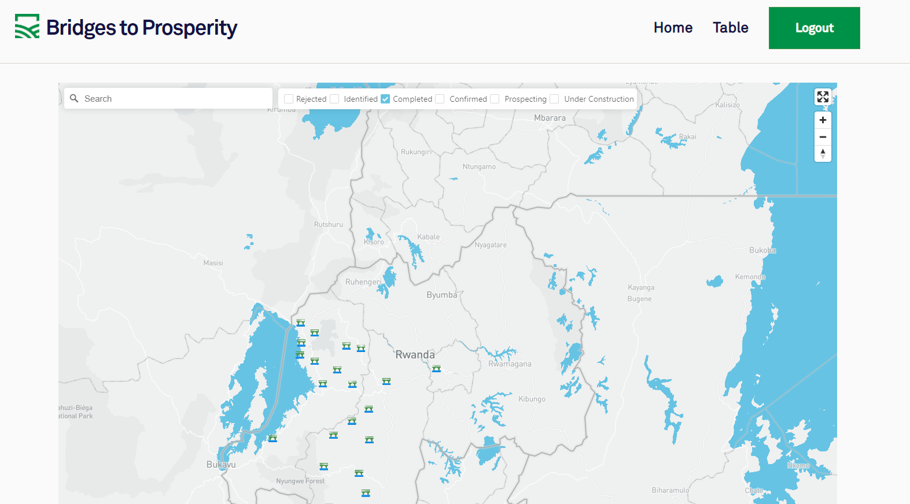

# Bridges To Prosperity

You can find the deployed project at https://www.28a.bridgestoprosperity.dev/

Previous cohort: https://b.bridgestoprosperity.dev/

You can find the demo video for this project at: https://youtu.be/szCUG177M44

Previous cohort:https://youtu.be/UkJIj0PbvIk

## Contributors

|                                           [Jonathan Thornton](https://github.com/Vippsi)                                           |                                       [David Ortega](https://github.com/dortega5185)                                        |                                                     [Dominique Kitchenakow](https://github.com/domikitchen)                                                     |
| :-----------------------------------------------------------------------------------------------------------------------------: | :-----------------------------------------------------------------------------------------------------------------------: | :----------------------------------------------------------------------------------------------------------------------------------------------------: |
|                     [](https://github.com/Vippsi)                     |                 [](https://github.com/dortega5185)                  | [](https://github.com/domikitchen) | [](https://github.com/) |
|                     [ ](https://github.com/Vippsi)                      |                   [ ](https://github.com/dortega5185)                   |                                [ ](https://github.com/domikitchen)                                |
| [  ](https://www.linkedin.com/in/jonathanthornton/) | [  ](https://www.linkedin.com/in/david-m-ortega/) | [  ](https://www.linkedin.com/in/dominique-kitchenakow/) |

<br>

## Project Overview

- [Trello Board](https://trello.com/b/5DFBGwvX/labs-28-bridges-to-prosperity-a)

<br/>

- Previous Cohort: https://trello.com/b/x1iIzJdj/labs25bridgesjessica

<br/>

- [Product Canvas](https://whimsical.com/CenFtxG9x65uEptPgBSEQw)

[](https://b.bridgestoprosperity.dev/)

<h2>Description</h2>

Our website receives and displays from data from our backend API. Displays data on mapbox interface, using React Map Gl, and also on ant design table. Users are unable to interact with the data on the mapbox interface and the table to view additional information and edit data points.

## Key Features

- Mapbox Interface (React Map Gl)
- Ant Design Table
- Yup Validations Formik Form

## Tech Stack

### Front end built using:

- Context API
- Okta
- Ant Design
- Axios
- React-map-gl
- React-map-gl-geocoder
- React-router-dom
- Formik & Yup
- Node-Sass

#### _Front end framework goes here_

- React

Why did you choose this framework?

- Our team had experience with the React Framework.

List the rest of the front end features and libraries in the same format as the framework above.

#### Front end deployed to `AWS`

https://www.28a.bridgestoprosperity.dev/

#### [Back end] built using:

https://github.com/Lambda-School-Labs/bridges-to-prosperity-be-a

#### back end framework goes here

- nodejs
- express
- postgreSQL
- Docker

# APIs

## Authentication API here

Okta API for Authentication:

The Okta Identity Cloud gives you one trusted platform to secure every identity in your organization and connect with all your customers.

## Environment Variables

```md
REACT_APP_CLIENT_ID=0oalwt....
REACT_APP_OKTA_ISSUER_URI=https://auth.../default
REACT_APP_API_URI=http://localhost:8005
REACT_APP_MAPBOX_TOKEN='pk.eyJ1Ij......'
```

## Content Licenses

🚫For all content - images, icons, etc, use this table to document permission of use. Remove the two placeholders and add you content to this table

| Image Filename    | Source / Creator | License                                          |
| ----------------- | ---------------- | ------------------------------------------------ |
| green bridge icon | Icons8           | [Icons8](https://icons8.com/license)             |
| rings.svg         | Sam Herbert      | [MIT](https://github.com/SamHerbert/SVG-Loaders) |

All the other images provided from Bridges to Prosperity


## Other Scripts

```json
 "scripts": {
    "start": "craco --max_old_space_size=4096 start",
    "build": "craco --max_old_space_size=4096 build",
    "test": "craco test --env=jest-environment-jsdom-sixteen",
    "eject": "react-scripts eject",
    "prettier": "prettier --write \"**/*.+(js|jsx|json|css|md)\"",
    "coverage": "npm test -- --coverage --watchAll=false",
    "lint": "eslint 'src/**/*.{js,jsx}' --fix",
    "format": "prettier --write 'src/**/*.{js,jsx,css,scss}'",
    "storybook": "start-storybook",
    "deploy-storybook": "storybook-to-ghpages"
  },
```

### Feature Requests

We would love to hear from you about new features which would improve this app and further the aims of our project. Please provide as much detail and information as possible to show us why you think your new feature should be implemented.

### Pull Requests

If you have developed a patch, bug fix, or new feature that would improve this app, please submit a pull request. It is best to communicate your ideas with the developers first before investing a great deal of time into a pull request to ensure that it will mesh smoothly with the project.

Remember that this project is licensed under the MIT license, and by submitting a pull request, you agree that your work will be, too.

#### Pull Request Guidelines

- Ensure any install or build dependencies are removed before the end of the layer when doing a build.
- Ensure that your code conforms to our existing code conventions.
- You may merge the Pull Request in once you have the sign-off of two other developers.

## Documentation

See [Backend Documentation](https://github.com/Lambda-School-Labs/bridges-to-prosperity-be-a) for details on the backend of our project.

See [React Map GL](https://visgl.github.io/react-map-gl/) for details on the mapbox interface library.


[](https://github.com/prettier/prettier)
