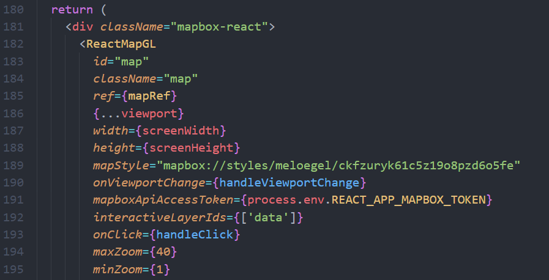
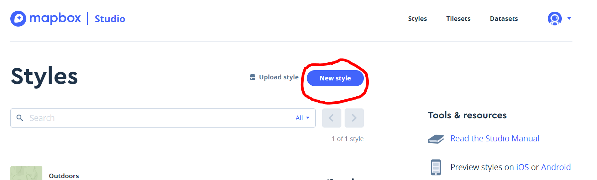
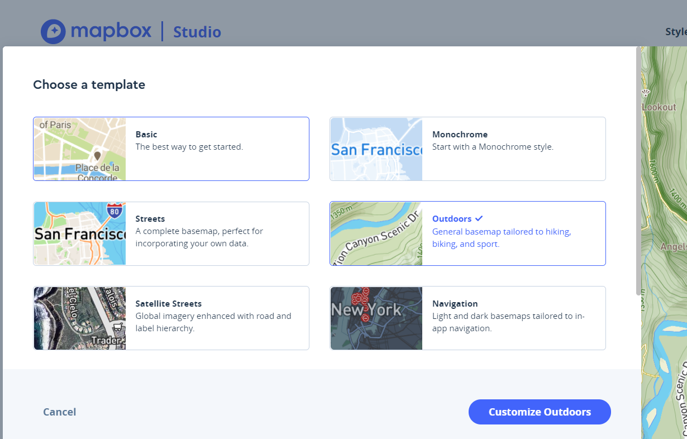
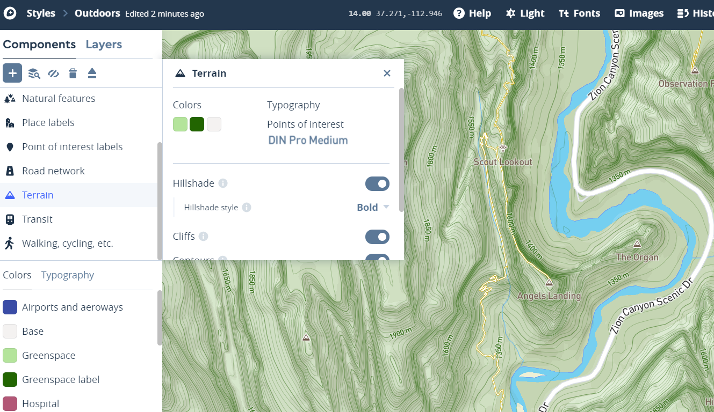
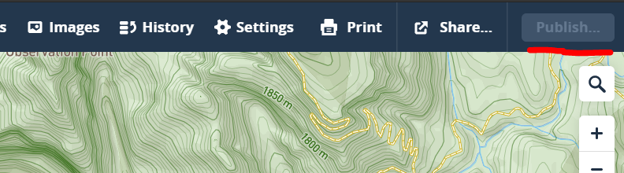
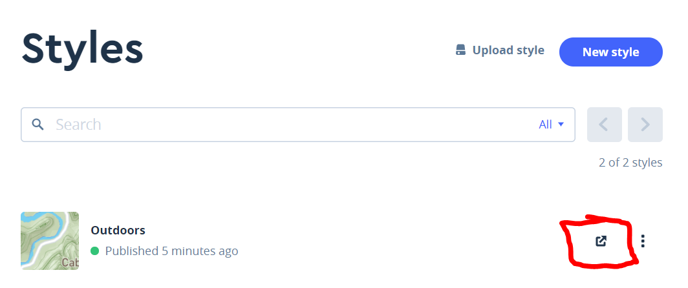
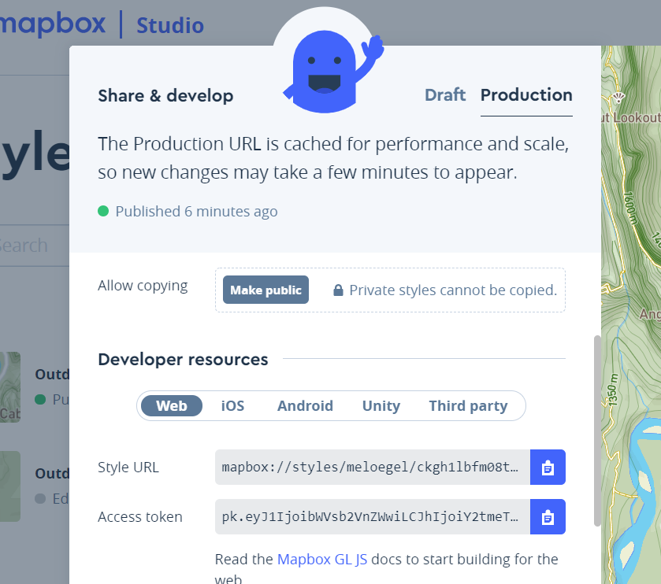

# Mapbox Map Style

## Description

The map style controls almost everything about the map. You can decide what roads to display, colors, location icons and much more. In this project we have created a custom Mapbox style in the Mapbox Studio Style Editor. Utilizing this tool has allowed us to display exactly what the stakeholder (at the time) was looking for (i.e. Topography). If in the future the stakeholders request changes or the current style link no longer works for some reason. This is readme will provide a brief walkthrough on how to create your own custom map style in Mapbox Studio Style Editor.

## Map Style Location

The mapStyle is located in the RenderMap.js.

[]

## Creating Custom Map Style

Step 1: Create Mapbox account and log in. (Should already have created account for Mapbox Token)

Step 2: Go to Mapbox Studio. (stuido.mapbox.com or click account in top right and sleect Studio)

Step 3: Click New Style.

[]

Step 4: Select your template and select customize at the bottom. (we selected Outdoors)

[]

Step 5: Customize your map.

[]

Step 6: Ensure your map is published and live.

[]

Step 7: Go back to the Mapbox Studio main page and you should see your Mapstyle. Click on share your style.

[]

Step 8: Scroll down to Developer resourses and copy your Stlye URL. Paste this URL into RenderMap.js.

[]
