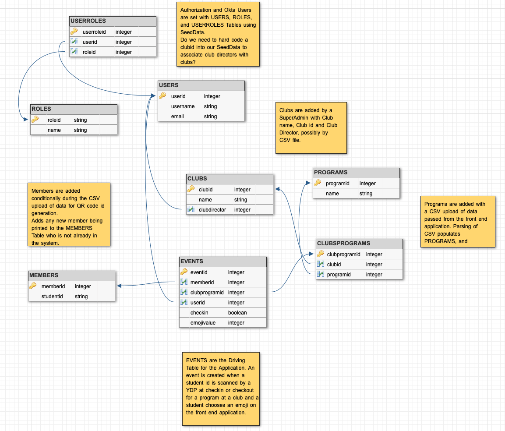

# 👋 Hi from Labs33

## Getting Started
### Okta
This application uses Okta for user identification/authentication instead of Spring Security. Login is handled on the frontend with Okta. All requests from the frontend application contain a bearer access token in the authorization header. Spring security authenticates the user with Okta and receives user info from the process. In the JwtAuthenticationFilter configuration file, the backend app checks for the user's authority/role using the username in the user table. All users are the preexisting ones given by Lambda. No users are created through the application. Roles have been assigned to users through SeedData for the application roles.

SUPERADMIN 
- llama001@maildrop.cc

CLUBDIR 
- llama002@maildrop.cc 
- llama003@maildrop.cc
- llama004@maildrop.cc

YDP 
- llama005@maildrop.cc
- llama006@maildrop.cc

USER 
- llama007@maildrop.cc

Authorization is handled with antMatchers in the OktaAuthSecurityConfig file. The USER is provided as a sanity check to make sure this user does not have authorization for any administrative actions.

### Running the application locally
- You will need to add the environment variables locally using a .properties file. 
- The variables needed can be obtained from your TPL.
- The issuer-uri and the issuer are the same value
- A sample oktajavaconf.properties file stored in your user directory

```properties
spring.security.oauth2.resourceserver.jwt.issuer-uri=<private-value-goes-here>
okta.oauth2.client-id=<private-value-goes-here>
okta.oauth2.issuer=<private-value-goes-here>
SPRING.DATASOURCE.URL=jdbc:postgresql://localhost:5432/<name-of-your-local-db>?password=password&sslmode=prefer&user=postgres
```

- add the file path for this file in your main foundation application class using the PropertySource annotation

```java
@PropertySource(value = "file:/<your-file-path>/oktajavaconf.properties", ignoreResourceNotFound = true)
```

You will need to make sure you have created a database with the same name set in the properties file using PGADMIN when running the app locally with Postgres. 

### Heroku Deployment
The backend site is deployed at the following URL 

https://bg-emotion-tracker-be-a.herokuapp.com

To access the Postgres tables using the h2-console, use the database variables found in the settings on your Heroku dashboard

### Testing with Postman
To test routes using Postman, you will need to login to the frontend application and get the Okta access_token from the Application tab in the Chrome Inspector window. This token has a one-hour expiration. You cannot obtain a token using a login route on the deployed app.


To use Postman, set the Authorization to Bearer Token and use the accessToken from above to test any routes.


## Proposed Database Schema and Current Tables



The application currently has tables/models for USERS, ROLES, USERROLES, CLUBS, PROGRAM, USERPROGRAMS, and MEMBERS. The EVENTS table and relationships for emotion tracking have not been developed. 

The CLUBS and PROGRAMS are connected in a many to many relationship through a join table CLUBSPROGRAMS.

The EMAILS table from the foundation application is still in the app but not currently in use.

## Current App Status

Release 1 and Release 2 from the project roadmap have been completed.
- User Roles exist for SUPERADMIN, CLUBDIR, YDP
- Kid Members are stored on the database but have no user authority
- SUPERADMIN and CLUBDIR users can upload a CSV to create members with kid memberid values
- SUPERADMIN and CLUBDIR users can submit a single kid memberid to be created
- SUPERADMIN and CLUBDIR users can upload a CSV of program information associating clubs and programs
- Memberids are returned to the frontend application to enable the creation of QR codes for printable id cards

### Routes currently in use by the Frontend App
Route information is available from Swagger documentation 
`https://bg-emotion-tracker-be-a.herokuapp.com/swagger-ui.html`

#### UserController
- GET request to `/users/getuserinfo` for loggedin user, including authority

#### MemberController
- GET request to `/members/members` for all members
- POST request to `/members/member` to add a single memberid
- POST request to `/members/upload` to add memberids using a CSV file
Both POST requests have built-in checks to allow duplicate info to be sent but not added to the database.

All members referenced in the CSV file or by single id are returned in the response to allow frontend to have access for creation of QR code ids without having to parse the CSV file.

Data validation exists that verifies the CSV file has a column header `memberid`

#### ProgramController
- GET request to `/programs/programs` to get all programs
- POST request to `/programs/upload` to add program name and club using a CSV file
- Sample existing clubs are currently hard coded in SeedData
- The join relationship between clubs and programs is handled in ProgramServiceImpl class in the saveNewPrograms method.

Data validation exists that verifies the CSV file contains two column headers and that they have the values `program name`,`club`

#### CSV Files
Sample member and program CSV files can be obtained from your TPL


