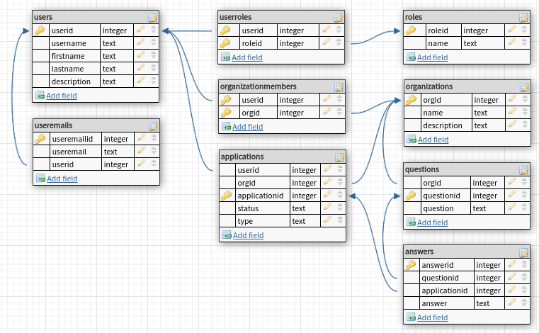

# Microfund MicroEntrepreneur Program Backend

# Overview

Many organizations around the world run microentrepreneur programs. People apply to these programs, and if they're accepted, they receive training. After completing training, they pitch a business idea to a panel, and they have the potential to receive a grant from the organization to start their business. Afterward, they provide regular reports to the organization and receive ongoing support, advice, and resources.

### Database layout

