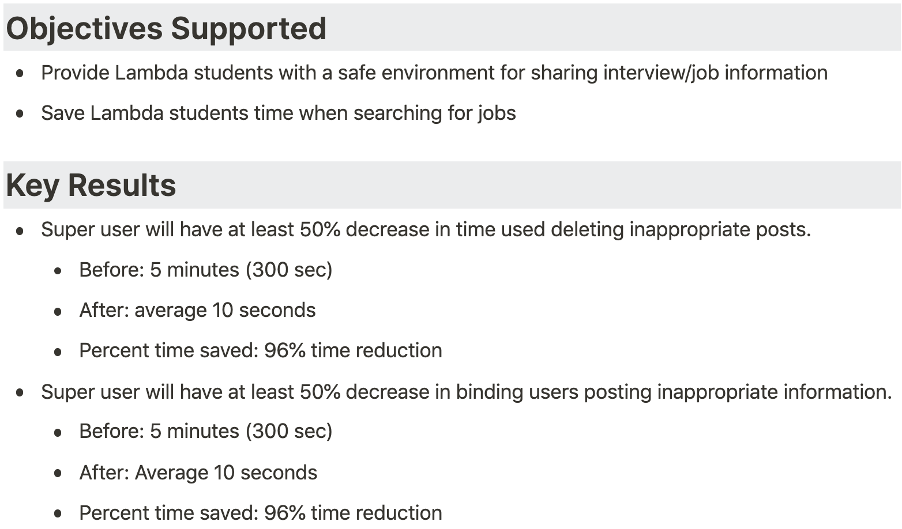
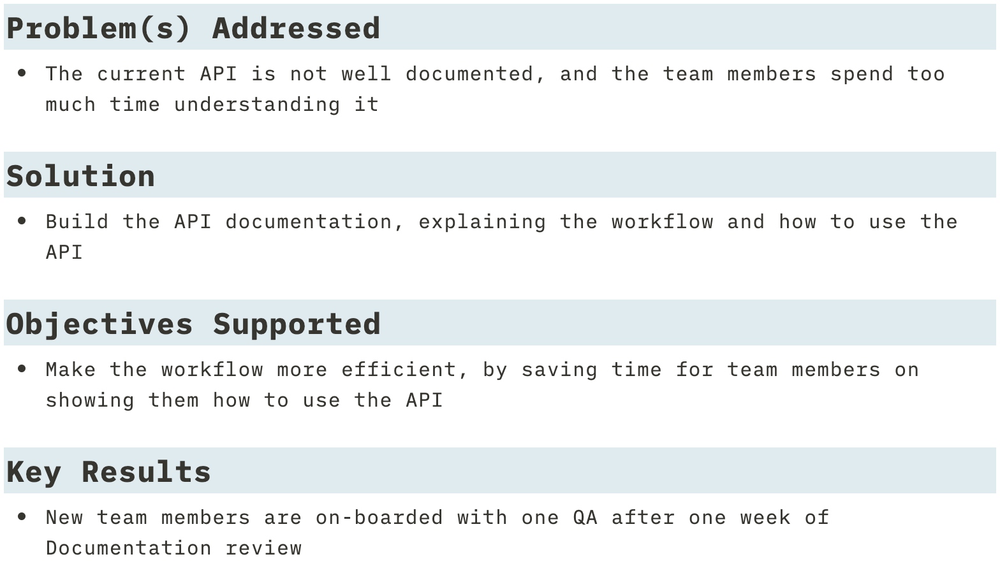

# DS Release Canvas examples
## Allay
### Description

The Labs 23 team started with this description from the Product Vision Document:

### Identify user problems that DS can help solve

This can be hard, especially for greenfield projects. The team struggled at first, but asked for help, and we found a good opportunity together:

### Data audit

During the Planning phase, you’re required to audit your data. What data do you have now? What data do you need, to solve the problem? What data can you get?

You could make a table that looks something like this:

Refer to these resources to help with your data audit:

*  [Google People + AI Guidebook: Data Collection + Evaluation](https://pair.withgoogle.com/chapter/data-collection/) 
*  [Building Machine Learning Powered Applications](https://mlpowered.com/pdf/BMLPA_Chapter_1.pdf) , PDF pages 33-35.

You may have heard that we don’t write code in Labs during the Planning phase. This is _generally_ true. However, DS is expected to write some code to do your data audit and identify DS opportunities.

### DS Release Canvas 1

This example is good overall, but it’s missing two requirements for DS RC1:

* Deploy baseline API
* Define how you measure success. 

### DS Release Canvas 2

DS teams will probably deliver fewer features than Web teams during Labs. For example, Web may release three features in cycle 1, then three more features in cycle 2. But DS may work on a single user feature across both cycles. This is accepted and expected!

The Labs 23 Allay DS team plans to work on the same problem and solution, but with different key results:

They created their lo-fi mockup with [Excalidraw](https://excalidraw.com/)

Refer to these resources for help with your lo-fi mockups:

*  [Building Machine Learning Powered Applications](https://mlpowered.com/pdf/BMLPA_Chapter_1.pdf) , PDF pages 21-22.
*  [Stakeholder-Driven Data Science](https://blog.dominodatalab.com/stakeholder-driven-data-science-warby-parker/)  @ 6:40 (“First example, retail site selection … We start with mockups.”)

### Web Release Canvas

DS and Web need to collaborate together. This Web RC has great OKRs! But it should be more explicit about integrating the DS API. 

## BetterReads
### Description

### Data Audit

### DS Release Canvas 1

Notice that RC1 does include “deploy baseline API”. This is a requirement.

Because this is a build-on project, the team plans to resolve open issues on GitHub. This is a good idea!

### Define how you’ll measure success 

By the end of cycle 1, you must define how you’ll measure the success of your model. It’s not easy, especially if your model is unsupervised and your data is unlabeled! This team did a great job coming up with a creative solution:

### DS Release Canvas 2

DS RC1 had one user story: “I want to receive book recommendations.”

The team could reuse the same use story for RC2. But they chose to rephrase it as “I want my book recommendations to be more accurate.” That’s good too!

### DS Release Canvas 3

If you have time, you can continue to iterate on your model, or work on new user features.

## Citrics

### Description

### Data audit

You aren’t required to make a detailed “data dictionary” during the planning phase, but it could be helpful to have at some point!

### DS Release Canvas 1

DS Release Canvas 3

## Groa
PVD

DS Release Canvas

API documentation

