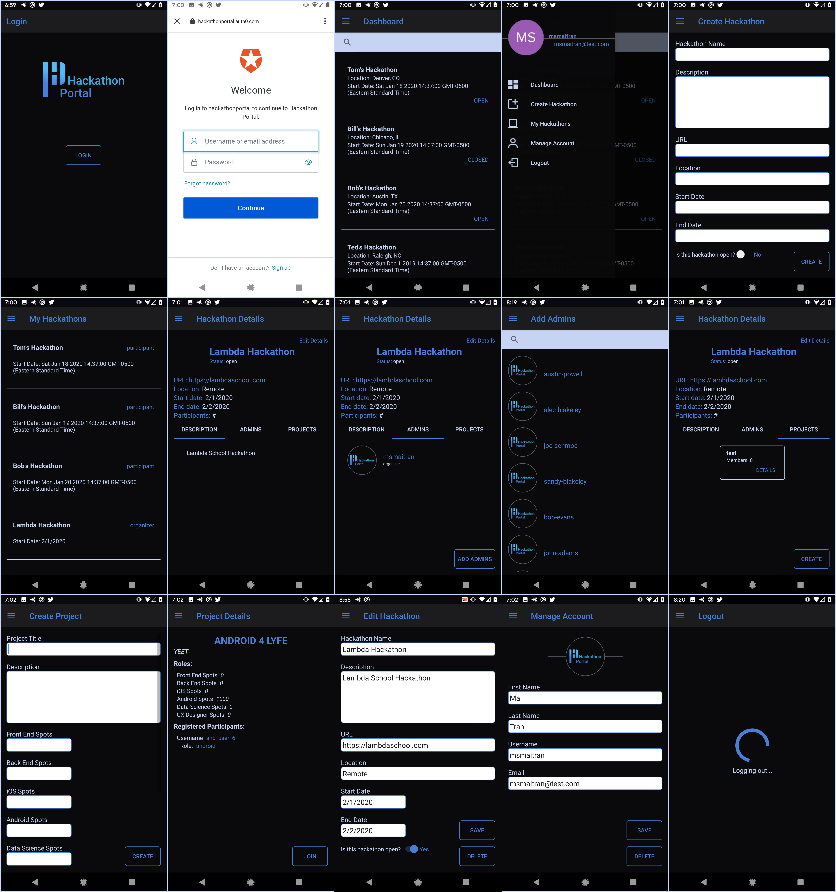

# Hackathon Portal

1️⃣ You can find the deployed project on [Google Play](https://play.google.com/store/apps/details?id=com.lambdaschool.hackathon_portal).

## 3️⃣ Contributors

|                                       [Tyler Clawson](https://github.com/tjclawson)                                        |                                       [Matthew Nelson](https://github.com/05nelsonm)                                        |                                       [Mai Tran](https://github.com/msmaitran)                                        |
| :-----------------------------------------------------------------------------------------------------------: | :-----------------------------------------------------------------------------------------------------------: | :-----------------------------------------------------------------------------------------------------------: |
|                                             |                                             |                                             |
|                 |                         |                       |
|  |  |  |

[![Android Version][android-image]][android-url]
[![Build Status][build-image]][build-url]
[![License][license-image]][license-url]

## Project Overview

1️⃣ You can find the deployed project on [Google Play](https://play.google.com/store/apps/details?id=com.lambdaschool.hackathon_portal).

[Trello Board](https://trello.com/b/4gkG3WXz/hackathon-android)

[Product Canvas](https://www.notion.so/Hackathon-Portal-Labs-19-611efb31ce5845d3bd235ee73af4383a)

[UX Design files](https://jameakidrick907440.invisionapp.com/freehand/Hackathon-Portal-9l4nR87js?v=5L7%2B2BrfGXHmN1Cfh3yQEQ%3D%3D&linkshare=urlcopied)

Hackathon Portal is an app that helps you easily create an account and then either organize or join hackathons.

### Features

-    Create an account and login via auth0
        -   Manage Account: Update/Delete account information
-    Dashboard: View a list of all hackathons
-    Create Hackathon (as an Organizer)
        -   Update/Delete Hackathon
-    My Hackathons: View a list of hackathons that user created or joined
-    Participant can create a project or join an existing project
-    Organizer can add additional Admins/Organizers to their hackathon

### Authentication API: Auth0

Auth0 is an authentication API that verifies the user's identity and then send the required information back to the app.

## Requirements

-   Android Studio 3.5 and above
-   Android 5.0 (API level 21) and above

## Contributing

When contributing to this repository, please first discuss the change you wish to make via issue, email, or any other method with the owners of this repository before making a change.

Please note we have a [code of conduct](./CODE_OF_CONDUCT.md). Please follow it in all your interactions with the project.

### Issue/Bug Request

 **If you are having an issue with the existing project code, please submit a bug report under the following guidelines:**
 - Check first to see if your issue has already been reported.
 - Check to see if the issue has recently been fixed by attempting to reproduce the issue using the latest master branch in the repository.
 - Create a live example of the problem.
 - Submit a detailed bug report including your environment & browser, steps to reproduce the issue, actual and expected outcomes,  where you believe the issue is originating from, and any potential solutions you have considered.

### Feature Requests

We would love to hear from you about new features which would improve this app and further the aims of our project. Please provide as much detail and information as possible to show us why you think your new feature should be implemented.

### Pull Requests

If you have developed a patch, bug fix, or new feature that would improve this app, please submit a pull request. It is best to communicate your ideas with the developers first before investing a great deal of time into a pull request to ensure that it will mesh smoothly with the project.

Remember that this project is licensed under the MIT license, and by submitting a pull request, you agree that your work will be, too.

#### Pull Request Guidelines

- Ensure any install or build dependencies are removed before the end of the layer when doing a build.
- Update the README.md with details of changes to the interface, including new plist variables, exposed ports, useful file locations and container parameters.
- Ensure that your code conforms to our existing code conventions and test coverage.
- Include the relevant issue number, if applicable.
- You may merge the Pull Request in once you have the sign-off of two other developers, or if you do not have permission to do that, you may request the second reviewer to merge it for you.

### Attribution

These contribution guidelines have been adapted from [this good-Contributing.md-template](https://gist.github.com/PurpleBooth/b24679402957c63ec426).

## Documentation

See [Backend Documentation](https://github.com/Lambda-School-Labs/hackathon-portal-be) for details on the backend of our project.

[android-image]: https://img.shields.io/badge/Android-3.5-brightgreen
[android-url]: https://developer.android.com/studio/releases/#3-5-0
[build-image]: https://img.shields.io/badge/API-21-orange
[build-url]: https://developer.android.com/studio/releases/platforms#5.0
[license-image]: https://img.shields.io/badge/License-MIT-blue.svg
[license-url]: LICENSE
