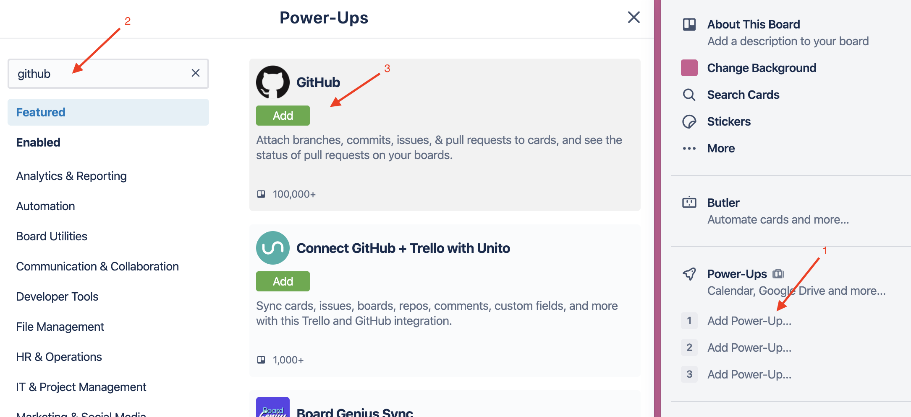
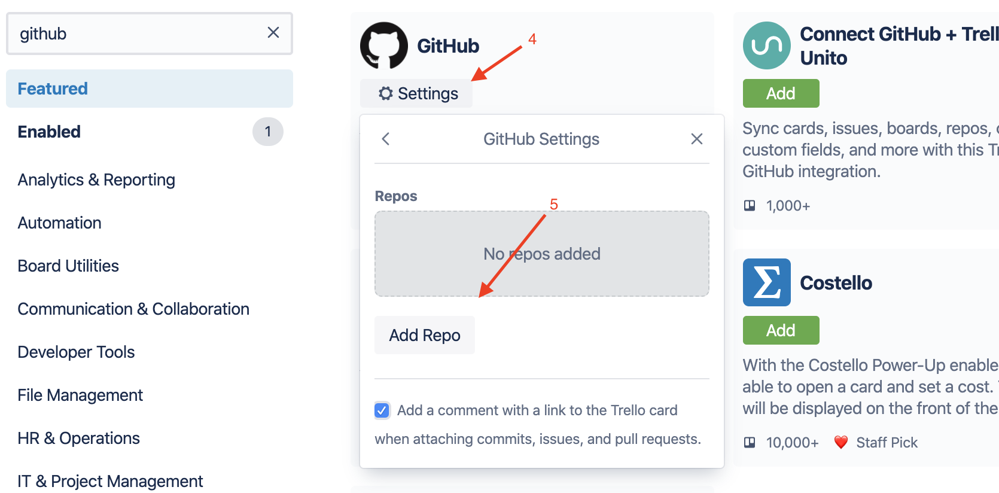
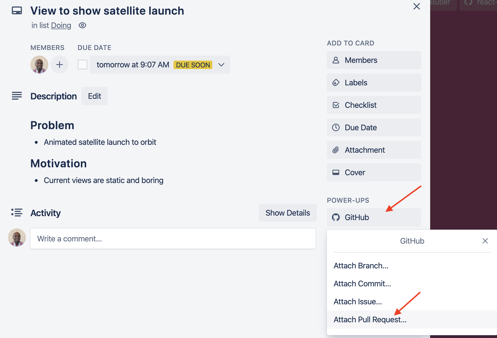
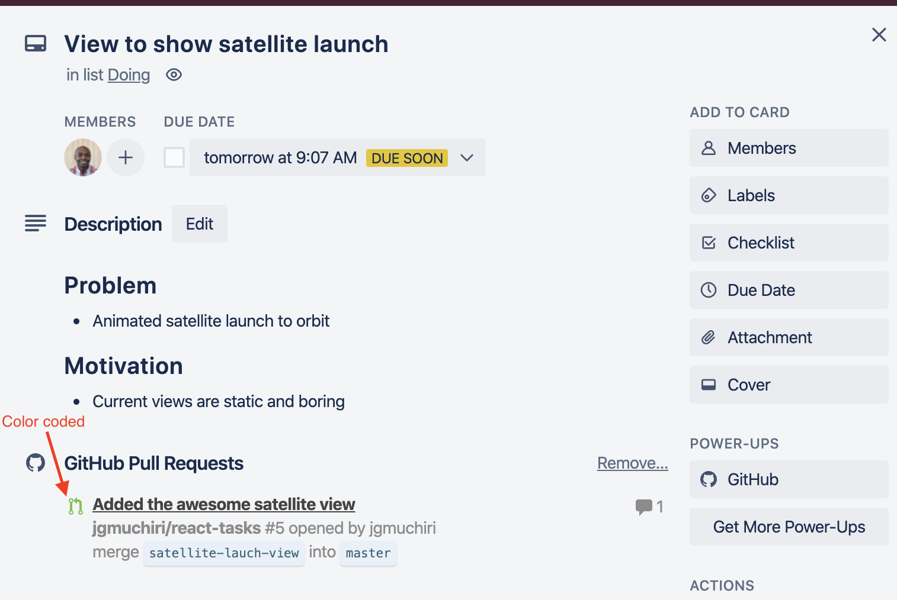
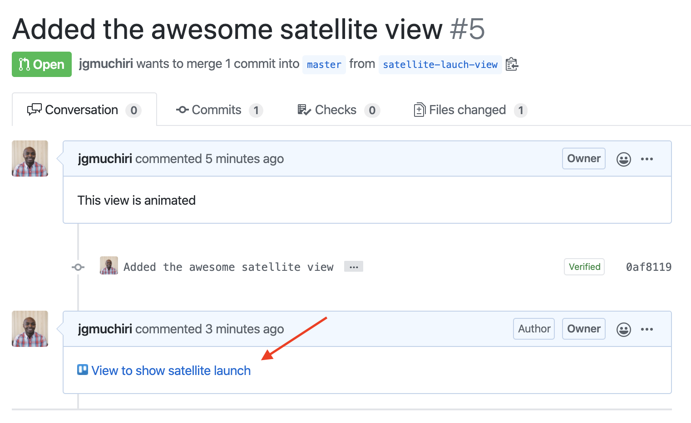
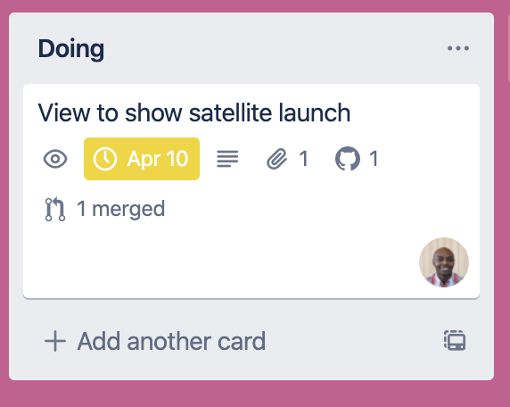

# Trello Integration

## Objective

This document will guide you through a step-by-step process to integrate your Trello board with Github. This integration will help you to keep track of your Pull Requests and issues within Trello.

### Technologies Discussed

* Github
* Trello

### References

[Github and Trello](https://blog.trello.com/github-and-trello-integrate-your-commits)



* Use GitHub Power-Up for Trello for attaching pull requests, issues,
  branches, and more to respective cards.
* Color coded to identify status of the PR such as open, merged, failed checks.
* You can also associate multiple repositories to one board.
  This is useful in a case where you are working on both frontend and backend
  from the same board.


### Add Github Power-Up to your Trello board

### Add repository

### Attach your Pull Request to Trello card

* PR now shows on the card. Color coded to show status of pull request

* A comment linking back to Trello will be automatically added to your PR

## Conclusion

Trello is a powerful but easy to use communication tool for your team. You can extend it's capabilities by further integrating your Github repository using other platforms such as [Zapier](https://zapier.com/apps/github/integrations/trello) to automatically create tasks from Github issues, among other features.
